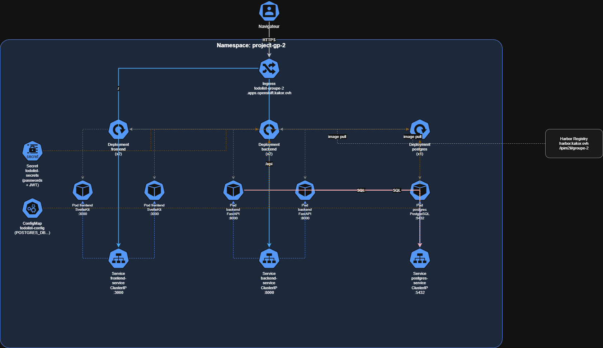
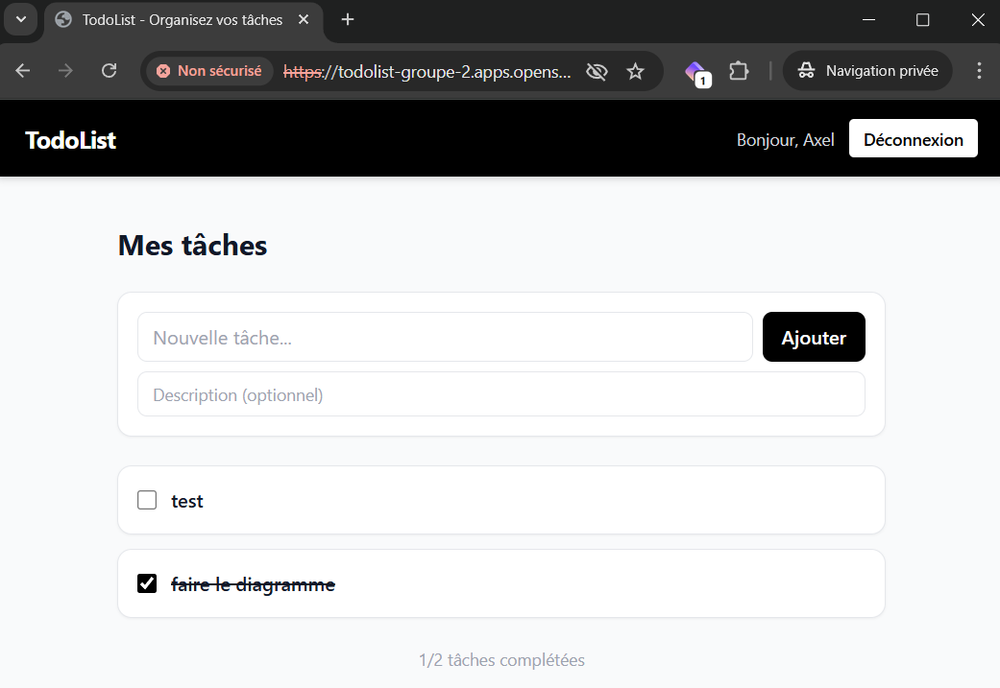

# TodoList — Déploiement Kubernetes / OpenShift

**Participants :**
- Axel GILBERT
- Virgile CAUJOLLE
- Max MENGERINGHAUSEN

---

## Description de l'application

TodoList est une application web de gestion de tâches avec authentification JWT. Elle permet à chaque utilisateur de créer un compte, se connecter, et gérer ses tâches personnelles (créer, compléter, supprimer).

### Stack technique

| Composant | Technologie |
|-----------|------------|
| Frontend | SvelteKit 2 + Tailwind CSS |
| Backend | FastAPI (Python 3.11) |
| Base de données | PostgreSQL 14 |
| Auth | JWT (HS256) |

---

## Architecture



### Objets Kubernetes/OpenShift utilisés

| Objet | Rôle |
|-------|------|
| **Namespace** | Espace isolé `project-gp-2` pour toutes les ressources du groupe |
| **Secret** | Stocke les données sensibles (mot de passe BDD, clé JWT) en base64 |
| **ConfigMap** | Stocke la configuration non-sensible (nom BDD, algorithme JWT) |
| **StatefulSet** | Déploie PostgreSQL avec identité et stockage stables |
| **PersistentVolumeClaim** | Réserve 1Gi de disque — les données survivent aux redémarrages |
| **Deployment** | Déploie backend et frontend avec 2 replicas, redémarrage automatique |
| **Service ClusterIP** | Adresse DNS interne stable pour chaque composant |
| **Ingress** | Expose le frontend en HTTPS public sur le domaine du cluster |

---

## Prérequis

- Docker Desktop installé
- CLI `oc` (OpenShift Client) installé — voir [releases OKD 4.19](https://github.com/okd-project/okd/releases/tag/4.19.0-okd-scos.19)
- Accès au cluster : `https://console-openshift-console.apps.openshift.kakor.ovh`
- Accès à la registry : `harbor.kakor.ovh`

---

## Déploiement

### 1. Tester en local avec Docker Compose

```bash
docker-compose up --build
# Frontend : http://localhost:3000
# Backend API docs : http://localhost:8000/docs
```

### 2. Builder et pousser les images sur Harbor

```bash
docker login harbor.kakor.ovh
# Username: ipi
# Password: B4teau123!

docker build -t harbor.kakor.ovh/ipim2il/groupe-2/backend:latest ./backend
docker build -t harbor.kakor.ovh/ipim2il/groupe-2/frontend:latest ./frontend

docker push harbor.kakor.ovh/ipim2il/groupe-2/backend:latest
docker push harbor.kakor.ovh/ipim2il/groupe-2/frontend:latest
```

### 3. Se connecter à OpenShift

Aller sur `https://console-openshift-console.apps.openshift.kakor.ovh`, se connecter avec `ipi-gp-2` via KeystoneIDP, puis aller dans "Copy login command" > "Display Token" et copier la commande `oc login` dans le terminal.

```bash
# Vérifier la connexion
oc get pod
```

### 4. Déployer sur OpenShift

```bash
# Se placer dans le bon namespace avant d'appliquer
oc project project-gp-2
oc apply -f k8s/
```

Vérifier le déploiement :
```bash
oc get all -n project-gp-2
```

### 5. Accéder à l'application

```
https://todolist-groupe-2.apps.openshift.kakor.ovh
```

## Capture d'écran



---

## Structure du projet

```
.
├── backend/                    # API FastAPI (Python 3.11)
│   ├── Dockerfile              # Image non-root (user appuser)
│   ├── requirements.txt
│   └── app/
│       ├── main.py
│       ├── core/config.py      # Config via variables d'environnement
│       ├── db/init_db.py       # SQLAlchemy session + create_tables
│       ├── models/             # User, Todo (SQLAlchemy)
│       ├── schemas/            # Validation Pydantic
│       └── api/endpoints/      # Routes auth + todos
├── frontend/                   # SvelteKit + Tailwind CSS
│   ├── Dockerfile              # Multi-stage, image non-root
│   ├── package.json
│   └── src/
│       ├── lib/api.ts          # Client HTTP vers le backend
│       ├── lib/stores.ts       # Store Svelte (token JWT, user)
│       └── routes/             # Pages SvelteKit
├── k8s/                        # Manifests Kubernetes/OpenShift
│   ├── 01-secrets.yaml         # Secrets chiffrés (BDD, JWT)
│   ├── 02-configmap.yaml       # Config non-sensible
│   ├── 03-postgres.yaml        # StatefulSet + PVC + Service
│   ├── 04-backend.yaml         # Deployment + Service
│   └── 05-frontend.yaml        # Deployment + Service + Route OpenShift
├── docker-compose.yml          # Test local uniquement
└── README.md
```

---

## Sécurité

- Tous les mots de passe et clés JWT sont dans des **Secrets Kubernetes**, jamais dans les images ni dans le code.
- Les Dockerfiles créent un **utilisateur non-root** (`appuser`) — requis par OpenShift qui refuse les containers root.
- PostgreSQL n'est accessible que via un **Service ClusterIP** interne — aucun accès depuis l'extérieur du cluster.
- En production, remplacer la clé JWT par une valeur forte : `openssl rand -base64 32`.
- Le volume PostgreSQL utilise `emptyDir` (éphémère) en raison d'un bug d'attachement de volume sur l'infrastructure OpenStack du cluster. En production, remplacer par un PersistentVolumeClaim.
